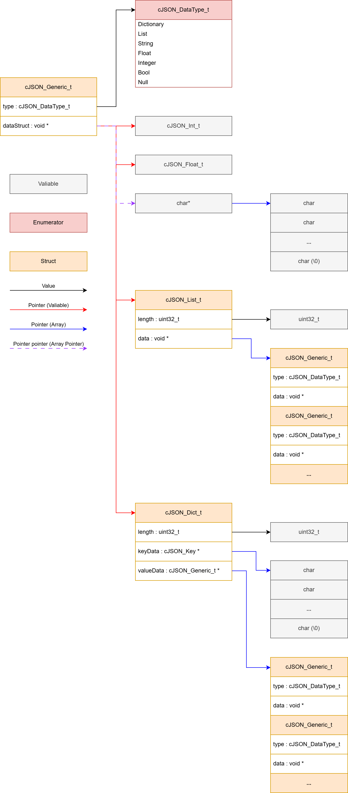

# cJSON Library

## Introduction

This is a c library for interfacing with JSON formatted data. It is only optimized for interfacing operations such as parsing and serialization (not yet implemented). There is no efficient dictionary access such as a hash map implemented for dictionaries.

## Constraints

The default maximum nesting depth of cJSON structures that will be handled by the parser is 255. This can be changed by either modifying the type definition for cJSON_depth_t or manually setting a limit by changing the CJSON_MAX_DEPTH macro in the cJSON_Constants file.

## JSON Object Data Storage

Object storage is based on the cJSON_Generic_t struct which contains type information as well as a pointer to the underlying object. It is defined as follows in the cJSON_Types.h file:

```c
typedef struct cJSON_Generic
{
    cJSON_ContainerType_t type;
    void *dataContainer;
} cJSON_Generic_t;
```

Structural types / JSON "objects" contain relevant information such as size and a list of keys (for dictionaries) in addition to lists of generic cJSON structs (cJSON_Generic_t). Data types on the other hand only contain a pointer to a variable to minimize memory usage.
The below image shows a graphical overview of how the different data types are linked to each other:

